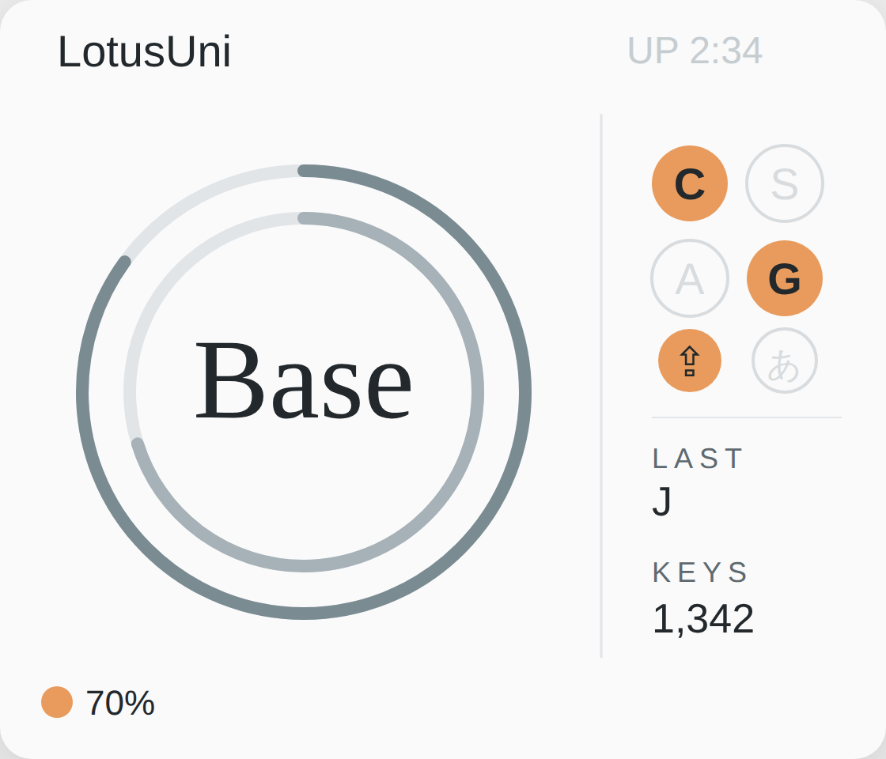

# Prospector ZMK Module — RING レイアウト(軽量版)

[Prospector](https://github.com/carrefinho/prospector) ディスプレイドングル向けのカスタムステータス画面 ZMK モジュールです。
このブランチはオリジナル Prospector ZMK Module をベースにしており、独自の **RING** レイアウトを追加しています。
`feat/ring-light` では表示画面をメイン画面のみに整理し、タッチ操作もメイン画面上で直接実行します。



> [!IMPORTANT]
> このブランチは開発中です。ZMK の Zephyr 4.1 ベースバージョン（現在の main）にのみ対応しています。

## 目次

- [特徴](#特徴)
- [インストール](#インストール)
- [ステータス画面](#ステータス画面)
- [使い方](#使い方)
- [設定](#設定)
- [トラブルシューティング](#トラブルシューティング)
- [既知の問題](#既知の問題)
- [To-Do](#to-do)
- [ライセンス](#ライセンス)

## 特徴

- 同心円バッテリーリング（ペリフェラル数 1〜3 に自動対応）
- レイヤー名表示
- ペリフェラルバッテリー残量表示
- CTRL / SHFT / ALT / GUI モディファイアチップ（押下時ハイライト）
- Caps Word インジケーター
- IME 状態インジケーター（変換キーで ON、無変換キーで OFF）
- 打鍵カウンター
- 最後に送出された HID キー表示（`LAST`、オプション）
- 起動後経過時間表示（`UP`、60 秒ごとに更新。[raw-hid-host](https://github.com/hrmt-lab/RawHID-host) 連携時は時刻表示）
- 左下の輝度アイコン + 輝度パーセント表示
- メイン画面の左右タップで輝度調整（CST816S タッチパネル搭載機、オプション）
- ダブルタップでライト / ダークテーマ切り替え（CST816S タッチパネル搭載機）
- 下スワイプ後、短時間内の右スワイプで Bootloader に入る（CST816S タッチパネル搭載機、オプション）
- AI Usage 画面（Claude / Codex の 5h・7d 使用率を縦棒グラフで表示。データはホストから RawHID で受信。長押しキー / 長押しタッチで Main と切替、オプション）

## インストール

ZMK キーボードはドングルをセントラルとしてセットアップしてください。

`config/west.yml` の `remotes` と `projects` に以下を追加します:

```yaml
manifest:
  remotes:
    - name: zmkfirmware
      url-base: https://github.com/zmkfirmware
    - name: hrmt-lab                               # <--- 追加
      url-base: https://github.com/hrmt-lab        # <--- 追加
  projects:
    - name: zmk
      remote: zmkfirmware
      revision: main
      import: app/west.yml
    - name: prospector-zmk-module-ring             # <--- 追加
      remote: hrmt-lab                             # <---
      revision: feat/ring-light                    # <---
  self:
    path: config
```

次に `build.yaml` のドングルに `prospector_adapter` シールドを追加します:

```yaml
---
include:
  - board: xiao_ble//zmk
    shield: [YOUR_KEYBOARD_SHIELD]_dongle prospector_adapter
```

ZMK モジュールとローカルビルドの詳細は [ZMK ドキュメント（モジュール）](https://zmk.dev/docs/features/modules) を参照してください。

## ステータス画面

RING を有効にするには `.conf` ファイルに以下を追加します:

```ini
CONFIG_PROSPECTOR_STATUS_SCREEN_RING=y
```

### RING レイアウトの構成

**左パネル — バッテリーリング**

ペリフェラル数（`ZMK_SPLIT_BLE_PERIPHERAL_COUNT`）に応じてリングが自動調整されます:

- **1 ペリフェラル** — 幅広の 1 本リング、大きなレイヤー名
- **2 ペリフェラル** — 2 本の同心円リング（デフォルト）
- **3 ペリフェラル** — 3 本のリング、やや小さめのレイヤー名
- 左下に現在の輝度を `%` 表示

**右パネル — 状態表示**

- 右上の起動後経過時間（`UP  0:12`、60 秒ごとに更新。[raw-hid-host](https://github.com/hrmt-lab/RawHID-host) 対応時は時刻/日付を表示）
- CTRL / SHFT / ALT / GUI モディファイアチップ
- CAPS / IME 状態チップ
- 最後に送出された HID キー（`LAST`、`CONFIG_PROSPECTOR_RING_LAST_KEY_DISPLAY` で無効化可能）
- 打鍵カウンター

RING は USB ドングル利用を主目的としているため、現在の RING 画面では出力先（USB/BLE）表示と BLE 時のドングルバッテリー表示は表示しません。

IME 状態は `INTERNATIONAL4`（変換）キーで ON、`INTERNATIONAL5`（無変換）キーで OFF になります。

## 使い方

**ペアリング順序**

スプリットキーボードでは、ドングルをフラッシュした後、左側のペリフェラルから先にペアリングしてください。ペリフェラルが 3 台以上ある場合は左から右の順でペアリングします。

**レイヤー名の設定**

レイヤー表示は `display-name` プロパティがあればそれを使用し、なければレイヤーインデックスを表示します。キーマップに `display-name` を追加するには:

```dts
keymap {
  compatible = "zmk,keymap";
  base {
    display-name = "Base";           # <--- 追加
    bindings = <
      ...
    >;
  }
}
```

**テーマ切り替え**

CST816S タッチパネルを搭載した Prospector ドングルでは、`CONFIG_PROSPECTOR_RING_DARK_TOGGLE_TOUCH=y` を有効にすることで、画面をダブルタップしてライトテーマとダークテーマを切り替えられます。

**メイン画面タッチ操作**

`CONFIG_PROSPECTOR_RING_GESTURE_NAV=y` を有効にすると、追加画面へ遷移せず、メイン画面上でタッチ操作を直接実行できます。テーマ切り替えとは独立して有効化できます:

| 操作 | 動作 |
|---|---|
| 画面左半分をタップ | 輝度を `CONFIG_PROSPECTOR_BRIGHTNESS_STEP` 下げる |
| 画面右半分をタップ | 輝度を `CONFIG_PROSPECTOR_BRIGHTNESS_STEP` 上げる |
| 下スワイプ後、短時間内に右スワイプ | 確認なしで Bootloader に入る |

輝度を変更すると、左下の輝度パーセント表示も更新されます。Bootloader 操作は確認画面を表示せず、条件成立時にすぐ Bootloader に入ります。

**AI Usage 画面**

`CONFIG_PROSPECTOR_RING_AI_USAGE=y` を有効にすると、Main 画面と AI Usage 画面を切り替えられます。AI Usage 画面は Claude / Codex の 5 時間枠・7 日枠の使用率を縦棒グラフで表示します（データは [zmk-rawhid-app](https://github.com/hrmt-lab/zmk-rawhid-app) モジュール等のキーボード側 RawHID 連携がホストから受信し、getter 経由で供給）。

| 操作 | 動作 |
|---|---|
| 切替キーを長押し（既定 F21、約 0.7 秒） | Main ↔ AI Usage を切替 |
| 画面を長押しタッチ（約 0.7 秒、CST816S 搭載機） | Main ↔ AI Usage を切替 |

長押し判定は「押し続けて閾値に達した時点」で切り替わります（離した瞬間ではありません）。切替キーは別途キーマップに割り当ててください（既定は F21）。使用率の色は使用率の値によらず各プロバイダーのブランドカラー固定です。詳細は [docs/ring-ai-usage-ui-spec.md](docs/ring-ai-usage-ui-spec.md) を参照してください。

## 設定

`.conf` ファイルに設定を追加してカスタマイズできます:

```ini
CONFIG_PROSPECTOR_USE_AMBIENT_LIGHT_SENSOR=n
CONFIG_PROSPECTOR_FIXED_BRIGHTNESS=80
CONFIG_PROSPECTOR_DISPLAY_IDLE_TIMEOUT=30
CONFIG_PROSPECTOR_BRIGHTNESS_KEY_CONTROL=y
```

### 共通設定

| 名前 | 説明 | デフォルト |
| ---- | --- | --------- |
| `CONFIG_PROSPECTOR_ROTATE_DISPLAY_180` | ディスプレイを 180 度回転 | n |
| `CONFIG_PROSPECTOR_USE_AMBIENT_LIGHT_SENSOR` | 照度センサーで輝度を自動調整 | y |
| `CONFIG_PROSPECTOR_FIXED_BRIGHTNESS` | 照度センサー無効時の固定輝度 | 50 (1–100) |
| `CONFIG_PROSPECTOR_DISPLAY_IDLE_TIMEOUT` | 無操作で画面をオフにするまでの秒数（`0` で無効） | 0 |
| `CONFIG_PROSPECTOR_BRIGHTNESS_KEY_CONTROL` | キーコードで輝度を調整 | n |
| `CONFIG_PROSPECTOR_BRIGHTNESS_UP_KEYCODE` | 輝度アップのキーコード | 115 (F24) |
| `CONFIG_PROSPECTOR_BRIGHTNESS_DOWN_KEYCODE` | 輝度ダウンのキーコード | 114 (F23) |
| `CONFIG_PROSPECTOR_BRIGHTNESS_STEP` | 1 回のキー押下/タップで変化する輝度 | 10 |
| `CONFIG_PROSPECTOR_LAYER_NAME_UPPERCASE` | レイヤー名を大文字に変換 | y |

輝度キー制御を有効にした場合は、設定したキーコードを送出するキーをキーマップに割り当ててください。デフォルトは F24（輝度アップ）/ F23（輝度ダウン）です。

### モディファイア設定

| 名前 | 説明 | デフォルト |
| ---- | --- | --------- |
| `CONFIG_PROSPECTOR_SHOW_MODIFIERS` | モディファイアインジケーターを表示 | y |

### RING ダークテーマ切り替え

| 名前 | 説明 | デフォルト |
| ---- | --- | --------- |
| `CONFIG_PROSPECTOR_RING_DARK_TOGGLE_TOUCH` | ディスプレイのダブルタップでライト/ダークテーマを切り替え（CST816S タッチコントローラー必須） | n |
| `CONFIG_PROSPECTOR_RING_DARK_TOGGLE_KEY` | キーコードでライト/ダークテーマを切り替え | n |
| `CONFIG_PROSPECTOR_RING_DARK_TOGGLE_KEYCODE` | テーマ切り替えキーコード（`DARK_TOGGLE_KEY` 有効時） | 111 (F20) |

### RING ステータス表示

| 名前 | 説明 | デフォルト |
| ---- | --- | --------- |
| `CONFIG_PROSPECTOR_RING_LAST_KEY_DISPLAY` | `LAST` に最後に送出された HID キーを表示 | y |

### RING メイン画面タッチ操作

| 名前 | 説明 | デフォルト |
| ---- | --- | --------- |
| `CONFIG_PROSPECTOR_RING_GESTURE_NAV` | メイン画面上のタッチ操作を有効化（CST816S タッチコントローラー必須。`DARK_TOGGLE_TOUCH` とは独立） | n |

### RING AI Usage 画面

| 名前 | 説明 | デフォルト |
| ---- | --- | --------- |
| `CONFIG_PROSPECTOR_RING_AI_USAGE` | AI Usage 画面を有効化（使用率データは `zmk-rawhid-app` 等のキーボード側 RawHID 連携が供給） | n |
| `CONFIG_PROSPECTOR_RING_AI_USAGE_TOGGLE_KEY` | キーコード長押しで Main ↔ AI Usage を切替 | n |
| `CONFIG_PROSPECTOR_RING_AI_USAGE_TOGGLE_KEYCODE` | 切替キーコード（`TOGGLE_KEY` 有効時） | 112 (F21) |
| `CONFIG_PROSPECTOR_RING_AI_USAGE_TOGGLE_TOUCH` | 画面長押しタッチで切替（CST816S タッチコントローラー必須） | n |

`CONFIG_PROSPECTOR_RING_AI_USAGE` 単体では画面は出ますが、使用率データはキーボード側の RawHID 連携（[zmk-rawhid-app](https://github.com/hrmt-lab/zmk-rawhid-app) の `CONFIG_RAWHID_APP_AI_USAGE`）が必要です。未供給時は `--` 表示になります。

## トラブルシューティング

### RAM オーバーフローエラー

ビルド時に `region 'RAM' overflowed` エラーが発生した場合は、`.conf` ファイルに以下を追加してディスプレイバッファサイズを削減してください:

```ini
CONFIG_LV_Z_VDB_SIZE=25
```

## 既知の問題

- ドングルへの接続後、一部のペリフェラルがキー入力を認識しないことがある。該当のペリフェラルをリセットしてください。[zmkfirmware/zmk#3156](https://github.com/zmkfirmware/zmk/issues/3156)
- バッテリー表示は最大 3 ペリフェラルまでの対応です。

## To-Do

- ライト / ダーク初期テーマの設定オプション
- レイヤー名スタイルのカスタマイズ

## ライセンス

MIT License

本プロジェクトは [carrefinho](https://github.com/carrefinho) による
[Prospector ZMK Module](https://github.com/carrefinho/prospector) を基に作成されています。
MIT ライセンスの条件に従い使用・改変・再配布することができます。

Copyright (c) 2024 carrefinho

---

# Prospector ZMK Module — RING Layout(Lightweight)

This is a [ZMK module](https://zmk.dev/docs/features/modules) that provides the **RING** custom status screen layout for the [Prospector](https://github.com/carrefinho/prospector) display dongle.
RING is one of the original layouts from the Prospector ZMK Module by carrefinho.
On `feat/ring-light`, RING uses a single main screen and handles touch actions directly on that screen.


> [!IMPORTANT]
> This branch is a work-in-progress and is only compatible with the Zephyr 4.1 version of ZMK (current main).

## Table of Contents

- [Features](#features)
- [Installation](#installation)
- [Status Screen](#status-screen)
- [Usage](#usage)
- [Configuration](#configuration)
- [Troubleshooting](#troubleshooting)
- [Known Issues](#known-issues)
- [To-Do](#to-do-1)
- [License](#license)

## Features

- Concentric battery arc rings (auto-adapts to 1–3 peripherals)
- Active layer name display
- Peripheral battery status
- CTRL / SHFT / ALT / GUI modifier chips (highlight when pressed)
- Caps Word indicator
- IME state indicator (INTERNATIONAL4 = ON, INTERNATIONAL5 = OFF)
- Keystroke counter
- Last emitted HID key display (`LAST`, optional)
- Uptime display (`UP`, updated every 60 seconds; shows time when linked with [raw-hid-host](https://github.com/hrmt-lab/RawHID-host))
- Brightness icon and percentage in the lower-left corner
- Tap left/right halves of the main screen to adjust brightness (CST816S touch panel, optional)
- Double-tap to toggle light / dark theme (CST816S touch panel)
- Swipe down, then swipe right shortly after, to enter Bootloader (CST816S touch panel, optional)
- AI Usage screen (vertical bar graphs of Claude / Codex 5h and 7d usage; data received from the host over RawHID; toggle with a long-press key / long-press touch, optional)

## Installation

Your ZMK keyboard should be set up with a dongle as central.

Add this module to your `config/west.yml` under `remotes` and `projects`:

```yaml
manifest:
  remotes:
    - name: zmkfirmware
      url-base: https://github.com/zmkfirmware
    - name: hrmt-lab                               # <--- add this
      url-base: https://github.com/hrmt-lab        # <--- and this
  projects:
    - name: zmk
      remote: zmkfirmware
      revision: main
      import: app/west.yml
    - name: prospector-zmk-module-ring             # <--- and these
      remote: hrmt-lab                             # <---
      revision: feat/ring-light                    # <---
  self:
    path: config
```

Then add the `prospector_adapter` shield to the dongle in your `build.yaml`:

```yaml
---
include:
  - board: xiao_ble//zmk
    shield: [YOUR_KEYBOARD_SHIELD]_dongle prospector_adapter
```

For more information on ZMK Modules and building locally, see [the ZMK docs page on modules](https://zmk.dev/docs/features/modules).

## Status Screen

Enable RING by adding the following to your `.conf` file:

```ini
CONFIG_PROSPECTOR_STATUS_SCREEN_RING=y
```

### RING Layout Structure

**Left panel — Battery rings**

The ring count and sizing adapt automatically to the peripheral count (`ZMK_SPLIT_BLE_PERIPHERAL_COUNT`):

- **1 peripheral** — single wide arc, large layer name
- **2 peripherals** — two concentric arcs (default)
- **3 peripherals** — three tighter arcs, slightly smaller layer name
- Current brightness percentage in the lower-left corner

**Right panel — Status indicators**

- Uptime in the top-right corner (`UP  0:12`, updated every 60 seconds; shows time/date when paired with [raw-hid-host](https://github.com/hrmt-lab/RawHID-host))
- CTRL / SHFT / ALT / GUI modifier chips
- CAPS / IME state chips
- Last emitted HID key (`LAST`, can be disabled with `CONFIG_PROSPECTOR_RING_LAST_KEY_DISPLAY`)
- Keystroke counter

RING is primarily designed for USB dongle use, so the current RING screen does not show the output endpoint (USB/BLE) or BLE-only dongle battery indicator.

IME state is inferred from key events: `INTERNATIONAL4` (変換) sets IME on, `INTERNATIONAL5` (無変換) sets IME off.

## Usage

**Pairing order**

For split keyboards, pair the left peripheral first after flashing the dongle, then the right side. For more than two peripherals, pair them left to right.

**Layer display name**

The layer display shows the `display-name` property when available, falling back to the layer index otherwise. To add a `display-name` to a keymap layer:

```dts
keymap {
  compatible = "zmk,keymap";
  base {
    display-name = "Base";           # <--- add this
    bindings = <
      ...
    >;
  }
}
```

**Theme toggle**

On Prospector dongles with a CST816S touch panel, enable `CONFIG_PROSPECTOR_RING_DARK_TOGGLE_TOUCH=y` to toggle between light and dark themes by double-tapping the display.

**Main-screen touch actions**

Enable `CONFIG_PROSPECTOR_RING_GESTURE_NAV=y` to run touch actions directly on the main screen without navigating to additional screens. This can be enabled independently from touch theme switching:

| Action | Result |
|---|---|
| Tap the left half | Decrease brightness by `CONFIG_PROSPECTOR_BRIGHTNESS_STEP` |
| Tap the right half | Increase brightness by `CONFIG_PROSPECTOR_BRIGHTNESS_STEP` |
| Swipe down, then swipe right shortly after | Enter Bootloader without confirmation |

Brightness changes update the lower-left percentage display immediately. The Bootloader gesture does not show a confirmation screen; once the gesture sequence is accepted, the dongle enters Bootloader immediately.

**AI Usage screen**

Enable `CONFIG_PROSPECTOR_RING_AI_USAGE=y` to switch between the Main screen and the AI Usage screen, which shows Claude / Codex 5-hour and 7-day usage as vertical bar graphs. The usage data is supplied by a keyboard-side RawHID handler that receives it from the host — typically the [zmk-rawhid-app](https://github.com/hrmt-lab/zmk-rawhid-app) module (as used on hitsuki46).

| Action | Result |
|---|---|
| Long-press the toggle key (default F21, ~0.7 s) | Switch Main ↔ AI Usage |
| Long-press the display (~0.7 s, CST816S panel) | Switch Main ↔ AI Usage |

The long-press fires once the threshold is reached **while still held** (not on release). Assign the toggle key in your keymap (default F21). Bar colors are fixed to each provider's brand color regardless of the usage value. See [docs/ring-ai-usage-ui-spec.md](docs/ring-ai-usage-ui-spec.md) for details.

## Configuration

Customize by adding config options to your `.conf` file:

```ini
CONFIG_PROSPECTOR_USE_AMBIENT_LIGHT_SENSOR=n
CONFIG_PROSPECTOR_FIXED_BRIGHTNESS=80
CONFIG_PROSPECTOR_DISPLAY_IDLE_TIMEOUT=30
CONFIG_PROSPECTOR_BRIGHTNESS_KEY_CONTROL=y
```

### General

| Name | Description | Default |
| ---- | ----------- | ------- |
| `CONFIG_PROSPECTOR_ROTATE_DISPLAY_180` | Rotate the display 180 degrees | n |
| `CONFIG_PROSPECTOR_USE_AMBIENT_LIGHT_SENSOR` | Use ambient light sensor for auto brightness | y |
| `CONFIG_PROSPECTOR_FIXED_BRIGHTNESS` | Fixed display brightness when not using ambient light sensor | 50 (1–100) |
| `CONFIG_PROSPECTOR_DISPLAY_IDLE_TIMEOUT` | Seconds of inactivity before turning the display and backlight off (`0` disables) | 0 |
| `CONFIG_PROSPECTOR_BRIGHTNESS_KEY_CONTROL` | Control display brightness with keycodes | n |
| `CONFIG_PROSPECTOR_BRIGHTNESS_UP_KEYCODE` | Keycode for increasing display brightness | 115 (F24) |
| `CONFIG_PROSPECTOR_BRIGHTNESS_DOWN_KEYCODE` | Keycode for decreasing display brightness | 114 (F23) |
| `CONFIG_PROSPECTOR_BRIGHTNESS_STEP` | Brightness adjustment per key press or touch tap | 10 |
| `CONFIG_PROSPECTOR_LAYER_NAME_UPPERCASE` | Convert layer names to uppercase | y |

When brightness key control is enabled, assign keys that emit the configured keycodes in your keyboard keymap. The defaults follow YADS/dongle-screen: F24 increases brightness and F23 decreases brightness.

### Modifiers

| Name | Description | Default |
| ---- | ----------- | ------- |
| `CONFIG_PROSPECTOR_SHOW_MODIFIERS` | Display modifier key indicators | y |

### RING Dark Theme Toggle

| Name | Description | Default |
| ---- | ----------- | ------- |
| `CONFIG_PROSPECTOR_RING_DARK_TOGGLE_TOUCH` | Toggle light/dark theme by double-tapping the display (requires CST816S touch controller) | n |
| `CONFIG_PROSPECTOR_RING_DARK_TOGGLE_KEY` | Toggle light/dark theme via keycode | n |
| `CONFIG_PROSPECTOR_RING_DARK_TOGGLE_KEYCODE` | Keycode for toggling theme (when `DARK_TOGGLE_KEY` is enabled) | 111 (F20) |

### RING Status Indicators

| Name | Description | Default |
| ---- | ----------- | ------- |
| `CONFIG_PROSPECTOR_RING_LAST_KEY_DISPLAY` | Show the last emitted HID key in the `LAST` field | y |

### RING Main-Screen Touch Actions

| Name | Description | Default |
| ---- | ----------- | ------- |
| `CONFIG_PROSPECTOR_RING_GESTURE_NAV` | Enable main-screen touch actions (requires CST816S touch controller; independent from `DARK_TOGGLE_TOUCH`) | n |

### RING AI Usage Screen

| Name | Description | Default |
| ---- | ----------- | ------- |
| `CONFIG_PROSPECTOR_RING_AI_USAGE` | Enable the AI Usage screen (usage data must be supplied by a keyboard-side RawHID handler) | n |
| `CONFIG_PROSPECTOR_RING_AI_USAGE_TOGGLE_KEY` | Toggle Main ↔ AI Usage via a long-pressed keycode | n |
| `CONFIG_PROSPECTOR_RING_AI_USAGE_TOGGLE_KEYCODE` | Keycode for toggling (when `TOGGLE_KEY` is enabled) | 112 (F21) |
| `CONFIG_PROSPECTOR_RING_AI_USAGE_TOGGLE_TOUCH` | Toggle via long-press touch (requires CST816S touch controller) | n |

`CONFIG_PROSPECTOR_RING_AI_USAGE` alone renders the screen, but usage data requires keyboard-side RawHID integration (the [zmk-rawhid-app](https://github.com/hrmt-lab/zmk-rawhid-app) module's `CONFIG_RAWHID_APP_AI_USAGE`). Without it, values show `--`.

## Troubleshooting

### RAM overflow error

If you encounter a `region 'RAM' overflowed` error when building, add the following to your `.conf` file to reduce the display buffer size:

```ini
CONFIG_LV_Z_VDB_SIZE=25
```

## Known Issues

- One peripheral may fail to register key presses after connecting to the dongle; reset the affected peripheral to fix. [zmkfirmware/zmk#3156](https://github.com/zmkfirmware/zmk/issues/3156)
- Battery display supports up to three peripherals.

## To-Do

- Config option for default light / dark theme on boot
- Layer name style customization

## License

MIT License

This project is based on the [Prospector ZMK Module](https://github.com/carrefinho/prospector) by [carrefinho](https://github.com/carrefinho), licensed under the MIT License.

Copyright (c) 2024 carrefinho
