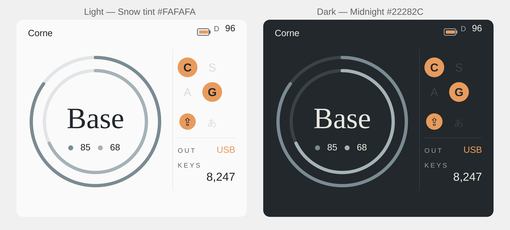

# Prospector Status Screen — RING Dark Layout 仕様書

ZMK + Zephyr 4.1（feat/new-status-screensブランチ）向け、Prospectorドングル用ステータス画面レイアウト「RING」のダークテーマ仕様書。

**ライトテーマ（`prospector-battery-rings-spec.md`）と本書を合わせて参照すること。** レイアウト・座標・アニメーション・ロジックはライトテーマと完全に共通。差分はカラートークンのみ。

---

## 1. 概要

### 1.1 サンプル



*左：ライトテーマ（Snow tint）/ 右：ダークテーマ（Midnight）。レイアウト・座標はすべて共通。*

### 1.2 コンセプト

WANAパレットのMidnight（`#22282C`）を背景に使用した、ライトテーマの完全な対となるダークテーマ。アクセントカラー（Muted Amber `#E89B5C`）とバッテリーリング2色はライトと共通のため、両テーマで「同じRINGレイアウト」という一貫した印象を保つ。

### 1.3 ライトテーマとの差分原則

- **共通（変更なし）**：レイアウト・座標・フォント・アニメーション・ロジック・accent・ring.p1・ring.p2・ring.p3
- **反転（ダーク用に変更）**：bg.primary / text.primary / text.secondary / text.off / ring.track

---

## 2. カラートークン

### 2.1 ダーク用トークン一覧

| 名前 | HEX | Light版 | 用途 |
|---|---|---|---|
| `bg.primary` | `#22282C` | `#FAFAFA` | 画面背景（Midnight） |
| `text.primary` | `#E9E7E1` | `#22282C` | レイヤー名・数値・キーボード名 |
| `text.secondary` | `#929FA7` | `#5F6A70` | OUT/KEYSラベル・Dラベル・凡例 |
| `text.off` | `#3A4248` | `#D8DCDF` | MOD/STATE OFF状態の文字 |
| `ring.track` | `#3A4248` | `#E2E5E8` | リングトラック・区切り線・separator |

### 2.2 共通トークン（Light/Dark 両方で同じ値）

| 名前 | HEX | 用途 |
|---|---|---|
| `accent` | `#E89B5C` | ON状態チップ・プロファイル番号・OUT強調 |
| `ring.p1` | `#7A8B92` | ペリフェラル1リング（最外周） |
| `ring.p2` | `#A6B2B8` | ペリフェラル2リング（中周） |
| `ring.p3` | `#C4CCD1` | ペリフェラル3リング（最内周） |

### 2.3 WANAパレットとの対応

| WANAカラー | HEX | ダークでの役割 |
|---|---|---|
| Midnight | `#22282C` | 背景（bg.primary）|
| Earth | `#E9E7E1` | 主要テキスト（text.primary）|
| Ocean | `#929FA7` | 副次テキスト（text.secondary）|

---

## 3. 要素別カラー仕様

ライトテーマからの変更箇所のみ記載。座標・サイズは `prospector-battery-rings-spec.md` Section 5 と完全に同一。

### 3.1 ヘッダ

| 要素 | Light | Dark |
|---|---|---|
| キーボード名 | `#22282C` | `#E9E7E1` |
| Dラベル | `#5F6A70` | `#929FA7` |
| Dongle電池数値 | `#22282C` | `#E9E7E1` |
| Dongle電池アイコン（枠・端子） | `#5F6A70` | `#929FA7` |

### 3.2 バッテリーリング・レイヤー部

| 要素 | Light | Dark |
|---|---|---|
| リングトラック | `#E2E5E8` | `#3A4248` |
| リングfill（ring.p1/p2/p3） | 共通 | 共通 |
| レイヤー名 | `#22282C` | `#E9E7E1` |
| バッテリードット fill | ring.p1/p2/p3（共通） | 共通 |
| バッテリー数値 | `#22282C` | `#E9E7E1` |

### 3.3 区切り線

| 要素 | Light | Dark |
|---|---|---|
| 縦区切り線 | `#E2E5E8` | `#3A4248` |

### 3.4 MOD / STATE チップ

| 状態 | 要素 | Light | Dark |
|---|---|---|---|
| ON | circle fill | `#E89B5C` | `#E89B5C`（共通） |
| ON | 文字色 | `#22282C` | `#22282C`（共通） |
| OFF | circle | 非表示 | 非表示（共通） |
| OFF | 文字色 | `#D8DCDF` | `#3A4248` |

ONチップの文字色は `#22282C` 固定。ライトでは「背景色と同じ」だがダークでは「Midnight色の文字がオレンジ上に乗る」形になるが、視覚的には問題ない。

### 3.5 separator / OUT / KEYS

| 要素 | Light | Dark |
|---|---|---|
| separator line | `#E2E5E8` | `#3A4248` |
| OUT/KEYSラベル | `#5F6A70` | `#929FA7` |
| OUT プロトコル名 | `#22282C` | `#E9E7E1` |
| OUT プロファイル番号 | `#E89B5C` | `#E89B5C`（共通） |
| KEYS 数値 | `#22282C` | `#E9E7E1` |

---

## 4. 実装方針

### 4.1 既存RINGレイアウトへの追加方法

ライトテーマのRINGレイアウトコードを流用し、Kconfigで切り替える。新たなレイアウトファイルを作るのではなく、**既存のRINGレイアウトにダークテーマの色定数を追加**するアプローチを推奨。

具体的には：

```c
// ring_theme.h
#ifdef CONFIG_ZMK_DISPLAY_STATUS_SCREEN_LAYOUT_RING_DARK
  // Dark theme tokens
  #define RING_BG           lv_color_hex(0x22282C)
  #define RING_TEXT_PRIMARY lv_color_hex(0xE9E7E1)
  #define RING_TEXT_SEC     lv_color_hex(0x929FA7)
  #define RING_TEXT_OFF     lv_color_hex(0x3A4248)
  #define RING_TRACK        lv_color_hex(0x3A4248)
#else
  // Light theme tokens (default)
  #define RING_BG           lv_color_hex(0xFAFAFA)
  #define RING_TEXT_PRIMARY lv_color_hex(0x22282C)
  #define RING_TEXT_SEC     lv_color_hex(0x5F6A70)
  #define RING_TEXT_OFF     lv_color_hex(0xD8DCDF)
  #define RING_TRACK        lv_color_hex(0xE2E5E8)
#endif

// 共通トークン（Light/Dark 両方で同じ値）
#define RING_ACCENT   lv_color_hex(0xE89B5C)
#define RING_RING_P1  lv_color_hex(0x7A8B92)
#define RING_RING_P2  lv_color_hex(0xA6B2B8)
#define RING_RING_P3  lv_color_hex(0xC4CCD1)
```

### 4.2 Kconfig への追加

```kconfig
choice ZMK_DISPLAY_STATUS_SCREEN_LAYOUT
    # 既存エントリ（変更なし）
    config ZMK_DISPLAY_STATUS_SCREEN_LAYOUT_RING
        bool "RING (Light)"

    # 新規追加
    config ZMK_DISPLAY_STATUS_SCREEN_LAYOUT_RING_DARK
        bool "RING (Dark)"
        help
          RING layout with Midnight dark theme.
endchoice
```

### 4.3 実装上の注意

- `ring_theme.h` を `ring_status_screen.c` からインクルードする形にすると、ライト/ダーク両方でソースを共有できる
- LVGLの `lv_obj_set_style_bg_color` 等の呼び出し箇所でトークンを使えば、テーマ切り替えは `ring_theme.h` の `#define` を変えるだけ
- フォント・座標・アニメーションのコードは一切変更不要

---

## 5. 確認用サンプル値

ライトテーマの Section 9 と同一。色のみ変わる。

| 項目 | 値 |
|---|---|
| キーボード名 | "Corne" |
| レイヤー名 | "Base" |
| P1 バッテリー | 85% |
| P2 バッテリー | 68% |
| D バッテリー | 96% |
| CTRL（C） | ON |
| SHFT（S） | OFF |
| ALT（A） | OFF |
| GUI（G） | ON |
| CAPS | ON |
| IME | OFF |
| OUT | BLE 1 |
| KEYS | 8,247 |

---

## 改訂履歴

| 日付 | 内容 |
|---|---|
| 2026-05-04 | 初版作成（RINGライトテーマの対となるダークテーマ仕様） |
