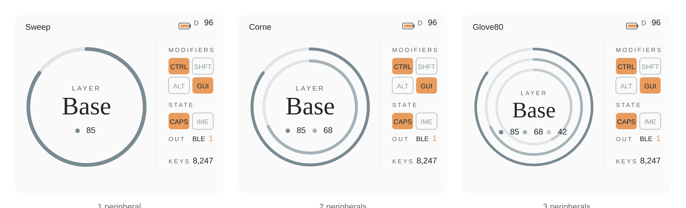

# Prospector Status Screen — RING Layout 仕様書

ZMK + Zephyr 4.1（feat/new-status-screensブランチ）向け、Prospectorドングル用カスタムステータス画面レイアウト「RING」の仕様書。

このレイアウトは、Prospector の `feat/new-status-screens` ブランチに既存する4つのレイアウト（RADII 等）を変更せず、**5つ目の選択肢として追加**するものとする。Kconfig による既存のレイアウト切替メカニズムに `RING` を追加し、ユーザーは従来通りビルド時にレイアウトを選択できる。

---

## 1. 概要

### 1.1 サンプル

最終確定版のレイアウト（ペリフェラル数1〜3のバリエーション）：



*ペリフェラル数（1〜3）に応じてリング数・太さ・配色が変動する。すべての例で：CTRL と GUI が押下中、CAPS WORD が ON、出力先は BLE プロファイル 1、ドングル電池 96%、セッション中の打鍵カウントは 8,247。1ペリフェラル例: Sweep（P1=85%）／2ペリフェラル例: Corne（P1=85%, P2=68%）／3ペリフェラル例: Glove80（P1=85%, P2=68%, P3=42%）。*

### 1.2 コンセプト

WANA STUDIOのカラーパレット（Midnight, Dust, Earth, Ocean, Snow）にオレンジのアクセントを加えた、明るくミニマルなレイアウト。中央の同心円が左右ペリフェラルのバッテリーゲージとして機能し、その中央にレイヤー名を配置する。RADII レイアウトの「同心円」というモチーフを継承しつつ、円自体に情報を持たせて装飾性と機能性を両立させた。レイアウト名「RING」は、この同心円を主役としたデザインに由来する。

### 1.3 ターゲットハードウェア

- **デバイス**：Prospector ZMK Dongle
- **ディスプレイ**：1.69インチ カラーLCD
- **解像度**：240 × 280 px（物理） → 90度回転して **280 × 240 px（横長）として使用**
- **ベース**：ZMK feat/new-status-screens ブランチ（Zephyr 4.1）

### 1.4 表示する情報

**必須**

- 現在のレイヤー名
- modキーの状態（CTRL / SHIFT / ALT / GUI）
- ペリフェラルのバッテリー残量（**1〜3個に対応**、ペリフェラル数はキーボードのKconfigで決まる）

**追加**

- キーボード名（ヘッダ左、ZMK_KEYBOARD_NAME から取得）
- ドングル本体のバッテリー残量（BLE接続時のみ）
- CAPS WORD 状態
- IME 状態
- 出力先（USB / BLE 1〜4）
- 打鍵カウント（セッション単位）

---

## 2. キャンバス・レイアウト

```
┌────────────────────────────────────────────────┐ y=0
│ Corne                          [▭▯] D 96       │ ← ヘッダ y=8〜22
├────────────────────────────────────────────────┤ y=36
│                            │  MODIFIERS         │
│                            │  ┌───┬───┐         │
│         ╭────────╮         │  │CTL│SHF│         │
│       ╭─╯  LAYER ╰─╮       │  ├───┼───┤         │
│      ╱    ╭────╮    ╲      │  │ALT│GUI│         │
│     │     │Base│     │     │  └───┴───┘         │
│      ╲    ╰────╯    ╱      │  STATE             │
│       ╰─ ●L 85 ●R 68─╯     │  ┌───┬───┐         │
│         ╰────────╯         │  │CPS│IME│         │
│                            │  └───┴───┘         │
│                            │  OUT  BLE  1       │
│                            │  KEYS  8,247       │
│                            │                    │
└────────────────────────────────────────────────┘ y=240
0   x=14         x=190    x=206              x=280
```

座標系は SVG と同じく **左上が原点 (0,0)**、右下が (280,240)。

### 2.1 主要領域

| 領域 | 範囲 (x,y) | 役割 |
|---|---|---|
| ヘッダ | (0,0) – (280,28) | キーボード名・ドングル電池 |
| 区切り線 | x=190, y=36〜208 | 左右パネル間の縦線 |
| 左パネル（リング部） | (0,28) – (190,240) | バッテリーリング・レイヤー名 |
| 右パネル（情報部） | (190,28) – (280,240) | mod・state・out・keys |

---

## 3. カラートークン

### 3.1 トークン一覧

| 名前 | HEX | 用途 |
|---|---|---|
| `bg.primary` | `#FAFAFA` | 画面背景（Snow tint） |
| `text.primary` | `#22282C` | 主要テキスト（レイヤー名・数値） |
| `text.secondary` | `#5F6A70` | 副次テキスト（ラベル `LAYER` 等） |
| `text.tertiary` | `#929FA7` | 補助テキスト（OFF状態の文字） |
| `accent` | `#E89B5C` | アクセント（mod ON、state ON、ハイライト） |
| `ring.p1` | `#7A8B92` | ペリフェラル1のリング（最外周） |
| `ring.p2` | `#A6B2B8` | ペリフェラル2のリング（中周）／2ペリフェラル時は内周 |
| `ring.p3` | `#C4CCD1` | ペリフェラル3のリング（最内周）／3ペリフェラル時のみ |
| `ring.track` | `#E2E5E8` | リング未充填部・区切り線・チップ枠線 |

### 3.2 カラーパレット参考（WANAパレット）

WANAパレットからの派生関係：

- Snow `#FFFFFF` → tint `#FAFAFA`（背景）
- Midnight `#22282C` → text.primary（無加工）
- Ocean `#929FA7` → ring.p1/p2/p3 の派生元（明度を段階的に変化）
- Dust `#E0E6EA` → ring.track の派生元

---

## 4. タイポグラフィ

### 4.1 フォント階層

| 用途 | 書体 | サイズ | weight | letter-spacing |
|---|---|---|---|---|
| レイヤー名（"Base" 等） | Georgia / セリフ | 34 | regular | 0 |
| キーボード名（"Corne" 等） | UI Sans-serif | 11 | medium (500) | 0 |
| 数値（バッテリー、KEYS、Out番号） | UI Sans-serif | 11 | medium (500) | 0 |
| チップ内テキスト（CTRL/CAPS等） | UI Sans-serif | 9 | medium (500) on ON, regular on OFF | 0 |
| セクションラベル（MODIFIERS等） | UI Sans-serif | 8 | regular | 2 |
| 凡例ラベル（L, R, D） | UI Sans-serif | 9 | regular | 0 |

### 4.2 LVGL での実装

LVGLでは以下のフォントが必要。`prj.conf` で組み込む：

```conf
CONFIG_LV_FONT_MONTSERRAT_8=y    # ラベル小
CONFIG_LV_FONT_MONTSERRAT_10=y   # チップ内・小数値
CONFIG_LV_FONT_MONTSERRAT_12=y   # 数値・キーボード名
CONFIG_LV_FONT_MONTSERRAT_14=y   # （余裕分）
```

レイヤー名のセリフ書体は別途用意。Prospectorでは独自フォントを `west build` 時に同梱できる。候補：

- **Cormorant Garamond** — 上品で線が細い
- **Playfair Display** — モダンで存在感あり
- **Source Serif Pro** — 可読性高めの選択肢
- **源泉明朝 / Noto Serif JP** — 日本語レイヤー名にも対応したい場合

LVGL標準には含まれないので、`lv_font_conv` などで TTF を C 配列に変換して組み込む。サイズは 28〜36px のいずれか1つで充分。

---

## 5. 要素別配置仕様

すべての座標は SVG viewBox (0,0)-(280,240) 基準。LVGL でも同じピクセル座標で実装可能。

### 5.1 ヘッダ

| 要素 | 内容 | 位置・サイズ | 表示条件 |
|---|---|---|---|
| キーボード名 | text | (14, 20) 左揃え, font: ui-sans 11 medium, color: text.primary | 常時 |
| ドングル電池アイコン | rect枠 + 端子 + fill | x=220-234, y=11-19（fill=accent, stroke=text.secondary） | BLE接続時のみ |
| `D` ラベル | text | (240, 14), ui-sans 9, color: text.secondary | BLE接続時のみ |
| ドングル電池数値 | text | (266, 14) 右揃え, ui-sans 11 medium, color: text.primary | BLE接続時のみ |

### 5.2 バッテリーリング・レイヤー部（左パネル）

ペリフェラル数（1〜3）に応じて、リング数・太さ・配色・数値配置・レイヤー名サイズが変動する。ペリフェラル数はキーボードのKconfigで決まる固定値で、ランタイムで変化することはない。

中心 = (96, 124)

#### リング配置パラメータ表

| パラメータ | 1ペリフェラル | 2ペリフェラル | 3ペリフェラル |
|---|---|---|---|
| リング数 | 1 | 2 | 3 |
| 半径（外→内） | 78 | 78, 62 | 78, 64, 50 |
| stroke-width | 5 | 4 | 3.5 |
| リング色（外→内） | ring.p1 | ring.p1, ring.p2 | ring.p1, ring.p2, ring.p3 |
| レイヤー名サイズ | 34 | 34 | 30 |
| レイヤー名 y 位置 | 134（中心+10） | 134（中心+10） | 138（中心+14） |
| LAYER ラベル y 位置 | 102（中心-22） | 102（中心-22） | 108（中心-16） |
| 数値ブロック y 位置 | 156（中心+32） | 156（中心+32） | 158（中心+34） |

#### 共通要素（ペリフェラル数によらず）

| 要素 | 詳細 |
|---|---|
| `LAYER` ラベル | (96, ※表参照), 中央揃え, ui-sans 8 regular, letter-spacing=2, color: text.secondary |
| レイヤー名 | (96, ※表参照), 中央揃え, serif ※表サイズ regular, color: text.primary |
| 各リングのトラック | circle r=※表参照, stroke=ring.track, stroke-width=※表参照 |
| 各リングの充填 | circle r=※表参照, stroke=※表参照, stroke-width=※表参照, stroke-linecap=round, transform=rotate(-90)、stroke-dasharray で残量に応じて描画 |

#### 数値ブロック配置（ドット + 数値、ラベル無し）

すべて中央揃え、ui-sans 11 medium, color: text.primary。ドットは r=3。

**1ペリフェラル**：1組を中央配置（数値が右揃えで12位置に終わる）
- ドット: (96-12, 156)、 fill=ring.p1
- 数値「85」: (96+12, 159) 右揃え

**2ペリフェラル**：2組を左右に等間隔配置
- P1ドット: (96-30, 156), fill=ring.p1
- P1数値: (96-6, 159) 右揃え
- P2ドット: (96+6, 156), fill=ring.p2
- P2数値: (96+30, 159) 右揃え

**3ペリフェラル**：3組を等間隔配置（やや密な配置）
- P1ドット: (96-44, 158), fill=ring.p1
- P1数値: (96-32, 161)
- P2ドット: (96-12, 158), fill=ring.p2
- P2数値: (96+0, 161)
- P3ドット: (96+20, 158), fill=ring.p3
- P3数値: (96+32, 161)

3ペリフェラル時は左揃え配置。1〜2ペリフェラル時は右揃え配置（ドット位置を基準点として）。

#### リングの数式

円周 C = 2π × r

| ペリフェラル数 | リング | 半径 | 円周 |
|---|---|---|---|
| 1 | P1 | 78 | 490.1 |
| 2 | P1 / P2 | 78 / 62 | 490.1 / 389.6 |
| 3 | P1 / P2 / P3 | 78 / 64 / 50 | 490.1 / 402.1 / 314.2 |

`stroke-dasharray = "{filled} {unfilled}"` で残量を表現：

- filled = C × (battery_pct / 100)
- unfilled = C - filled

12時方向から時計回りに描画するため `transform="rotate(-90)"` を起点に適用。

### 5.3 区切り線

```
line x1=190 y1=36 x2=190 y2=208 stroke=ring.track stroke-width=0.6
```

### 5.4 MODIFIERS（右パネル上段）

セクションラベル `MODIFIERS` : (206, 50), ui-sans 8 regular, letter-spacing=2, color: text.secondary

チップグリッド（左上原点 (206, 58)）：

| Position | キー | チップ位置（相対） |
|---|---|---|
| 左上 | CTRL | (0, 0) |
| 右上 | SHFT | (32, 0) |
| 左下 | ALT | (0, 26) |
| 右下 | GUI | (32, 26) |

各チップ：rect 28 × 22, rx=4

**ON状態**：
- fill=accent
- 内部テキスト：ui-sans 9 medium, color=text.primary（`#22282C`）

**OFF状態**：
- fill=none, stroke=ring.track, stroke-width=0.8
- 内部テキスト：ui-sans 9 regular, color=text.tertiary（`#929FA7`）

テキストは中央揃え、各チップ中心 (14, 15) または (46, 15) など。

### 5.5 STATE（右パネル中段）

セクションラベル `STATE` : (206, 124), 同様

チップグリッド（左上原点 (206, 132)）：

| Position | 名前 | チップ位置（相対） |
|---|---|---|
| 左 | CAPS | (0, 0) |
| 右 | IME | (32, 0) |

サイズ・スタイルは MODIFIERS と完全に同一。

### 5.6 OUT（右パネル下段）

ラベル+値の単一行（y=170）：

| 要素 | 位置 | スタイル |
|---|---|---|
| `OUT` ラベル | (206, 170) | ui-sans 8 regular, letter-spacing=2, color: text.secondary |
| プロトコル名 | (238, 170) | ui-sans 9 medium, color: text.primary（"BLE" or "USB"） |
| プロファイル番号 | (266, 170) 右揃え | ui-sans 11 medium, color: accent |

USB時は番号を非表示。プロトコル名のみ右寄せに変更（color: accent）。

### 5.7 KEYS（右パネル最下段）

| 要素 | 位置 | スタイル |
|---|---|---|
| `KEYS` ラベル | (206, 200) | ui-sans 8 regular, letter-spacing=2, color: text.secondary |
| カウント値 | (266, 200) 右揃え | ui-sans 11 medium, color: text.primary |

カウント値はカンマ区切り表示（例 `8,247`）。

---

## 6. 状態遷移仕様

### 6.1 ペリフェラル接続状態

ペリフェラルごとに以下の4状態を表現する。ペリフェラル数（1〜3）はキーボードのKconfigで決まる固定値で、ランタイム変動なし。各ペリフェラルスロットは独立に状態を持つ。

| ペリフェラル状態 | リング描画 | 数値表示 | ドット |
|---|---|---|---|
| 接続あり / バッテリ既知 | 残量に応じてfill | `85` | fill=ring.pX color |
| 接続あり / バッテリ不明 | トラックのみ | `?` | fill=ring.pX color |
| 未接続 | トラックのみ | `-`（ハイフン） | fill=none, stroke=ring.track 0.8 |
| 接続あり / 0% | トラックのみ（filledなし） | `0` | fill=ring.pX color |

未接続ペリフェラルがあっても、そのスロットの位置にドット・数値の領域は確保し続ける（レイアウトはずれない）。

ドングルバッテリー（D）は USB接続時に **要素ごと非表示**。


### 6.2 出力先（OUT）

| ZMK状態 | 表示 |
|---|---|
| `ZMK_ENDPOINT_USB` | `OUT     USB` （USBがacccent色） |
| `ZMK_ENDPOINT_BLE`, profile=0 | `OUT  BLE  1` |
| `ZMK_ENDPOINT_BLE`, profile=1 | `OUT  BLE  2` |
| 〜 profile=4 | `OUT  BLE  5` |

プロファイル番号は内部値+1で表示する（ZMK内部は0始まり）。

### 6.3 修飾キー（mod）の取得

ZMK のリスナで HID modifier byte を購読し、各bitに対応するチップを ON/OFF 切替：

| HID bit | mod | チップ |
|---|---|---|
| 0 | LCTRL | CTRL |
| 1 | LSHIFT | SHFT |
| 2 | LALT | ALT |
| 3 | LGUI | GUI |
| 4 | RCTRL | CTRL（同チップ） |
| 5 | RSHIFT | SHFT（同チップ） |
| 6 | RALT | ALT（同チップ） |
| 7 | RGUI | GUI（同チップ） |

左右どちらのmodでも同じチップが点灯する。

### 6.4 CAPS WORD / IME

- CAPS WORD：ZMKの `caps_word` behavior の active 状態を購読
- IME：ZMKの `&kp LANG1` などの押下を検知して内部状態を保持／または専用 behavior を実装。実装方法はキーマップに依存

### 6.5 KEYS（打鍵カウント）

セッション単位（ドングル起動以来のカウント）。

- カウント対象：HID key press イベント全て（modifier含む / 含まない は実装時に決定）
- 表示桁数：最大5桁（99,999まで対応、それ以上は `99k+` 等にフォールバック検討）
- 不揮発化なし（電源OFFでリセット）

---

## 7. アニメーション仕様

### 7.1 起動時

| アニメ | 対象 | 開始 | 持続 | easing |
|---|---|---|---|---|
| A. リング描画L | L 充填 stroke-dasharray を 0→残量 | 0 ms | 700 ms | ease-out (cubic) |
| A. リング描画R | R 充填 stroke-dasharray を 0→残量 | 150 ms | 700 ms | ease-out (cubic) |
| B. レイヤー名フェード | レイヤー名 opacity 0→100 | 400 ms | 600 ms | ease-out |

総時間：約 1000 ms。LVGLでは：

```c
// L ring
lv_anim_init(&anim_l);
lv_anim_set_var(&anim_l, ring_l_obj);
lv_anim_set_values(&anim_l, 0, batt_l_pct);
lv_anim_set_time(&anim_l, 700);
lv_anim_set_path_cb(&anim_l, lv_anim_path_ease_out);
lv_anim_set_exec_cb(&anim_l, ring_set_value_cb);
lv_anim_start(&anim_l);

// R ring with delay
lv_anim_init(&anim_r);
// ...
lv_anim_set_delay(&anim_r, 150);
lv_anim_start(&anim_r);

// Layer fade
lv_anim_init(&anim_layer);
lv_anim_set_var(&anim_layer, layer_label);
lv_anim_set_values(&anim_layer, 0, 255);
lv_anim_set_time(&anim_layer, 600);
lv_anim_set_delay(&anim_layer, 400);
lv_anim_set_exec_cb(&anim_layer, opa_anim_cb);
lv_anim_start(&anim_layer);
```

### 7.2 レイヤー切替時

| アニメ | 対象 | タイミング | 持続 | easing |
|---|---|---|---|---|
| D. クロスフェード | レイヤー名 opacity 100→0 | 0 ms | 200 ms | ease-in-out |
| D. クロスフェード | レイヤー名テキスト変更 + opacity 0→100 | 200 ms | 200 ms | ease-in-out |
| F. リング点滅L | L 充填 stroke を accent | 0 ms | 0 ms（即時） | - |
| F. リング点滅R | R 充填 stroke を accent | 0 ms | 0 ms（即時） | - |
| F. リング復帰 | 両リング stroke を ring.l / ring.r に戻す | 150 ms 後 | 0 ms（即時） | - |

実装：レイヤー変更イベントを検知 → 即時にリング色を accent に変更し、`lv_timer_create_basic` で 150ms後に元色へ戻す。並行してレイヤー名のクロスフェード。

### 7.3 通常時

| イベント | 挙動 |
|---|---|
| バッテリー値変動 | 即時切替（補間なし） |
| modキー押下 / 離す | 即時切替（チップの fill 変更） |
| CAPS / IME 切替 | 即時切替 |
| OUT 切替 | 即時切替 |
| KEYS インクリメント | 即時切替（数値更新のみ） |

modキー含めて応答性を最優先するため、通常時の状態変化はアニメーションなし。

---

## 8. 実装メモ（LVGL）

### 8.1 オブジェクト階層

```
screen (lv_obj_create)
├── header_keyboard_name (lv_label)
├── header_dongle_icon (lv_obj custom drawn or image)
├── header_dongle_label (lv_label "D")
├── header_dongle_value (lv_label "96")
├── ring_track_l (lv_arc, range 0-100, value=100, no animation, gray)
├── ring_track_r (lv_arc)
├── ring_l (lv_arc, value=batt_l_pct)
├── ring_r (lv_arc, value=batt_r_pct)
├── layer_label (lv_label "LAYER")
├── layer_name (lv_label "Base", custom serif font)
├── batt_l_dot (lv_obj small circle)
├── batt_l_label (lv_label "L")
├── batt_l_value (lv_label "85")
├── batt_r_dot, batt_r_label, batt_r_value (同様)
├── divider (lv_obj 1px line)
├── modifiers_label (lv_label "MODIFIERS")
├── mod_chip_ctrl, mod_chip_shft, mod_chip_alt, mod_chip_gui (lv_obj rect with text child)
├── state_label (lv_label "STATE")
├── state_chip_caps, state_chip_ime (同上)
├── out_label, out_proto, out_profile (lv_label)
└── keys_label, keys_value (lv_label)
```

### 8.2 リング実装の注意点

LVGLの `lv_arc` を使うのが標準だが、`stroke-dasharray` 相当の制御ができないため、以下の方式を選択：

**方式A：lv_arc を使用**
- `lv_arc_set_bg_angles(arc, 0, 360)` で全周トラック
- `lv_arc_set_angles(arc, 270, 270 + 360 * pct / 100)` で残量分を描画
- 12時方向起点なので 270度から開始

**方式B：カスタム描画**
- `lv_obj_draw_part` イベントを使い、円弧を直接描画
- より細かい制御が可能だが実装工数増

**推奨：方式A**。LVGLの標準機能で十分実現可能。

### 8.3 既存Prospectorコードへの統合

**基本方針：既存4レイアウトは一切変更せず、5つ目の選択肢として `RING` を追加する。** Prospector の `feat/new-status-screens` ブランチには既に複数のレイアウト（RADII含む）があり、Kconfig の choice ブロックで切り替え可能になっている。この既存メカニズムを尊重し、`RING` を新たな選択肢として追加するだけにする。

#### ファイル追加

新規作成するファイルのみで完結させる：

- `<既存レイアウトと同じ階層>/ring_status_screen.c` — レイアウト本体
- `<既存レイアウトと同じ階層>/ring_status_screen.h` — 公開API宣言
- `<既存レイアウトと同じ階層>/ring_widgets/` — ウィジェット部品ファイル群（規模に応じて）
- セリフフォント用の C 配列ファイル（例：`fonts/cormorant_serif_32.c`）

ファイル名・配置は既存4レイアウトの命名規約を踏襲すること（実装前に既存コードを読んで合わせる）。

#### 既存ファイルへの最小限の修正

既存ファイルへの修正は以下の3点のみに限定する。既存レイアウトのコードや動作には一切影響を与えない：

1. **`Kconfig`** — choice ブロックに新エントリを追加する1箇所のみ。既存エントリはそのまま：
   ```kconfig
   choice ZMK_DISPLAY_STATUS_SCREEN_LAYOUT
       prompt "Status screen layout"

       # 既存エントリ（変更しない）
       config ZMK_DISPLAY_STATUS_SCREEN_LAYOUT_RADII
           bool "RADII"
       # ... 他3つの既存レイアウト ...

       # 新規追加
       config ZMK_DISPLAY_STATUS_SCREEN_LAYOUT_RING
           bool "RING"
           help
             Concentric battery rings layout with WANA-inspired palette.
   endchoice
   ```

2. **`CMakeLists.txt`** — 新規ソースの条件付きコンパイルを追加：
   ```cmake
   target_sources_ifdef(CONFIG_ZMK_DISPLAY_STATUS_SCREEN_LAYOUT_RING app PRIVATE
     ring_status_screen.c
     # 必要に応じて他のファイル
   )
   ```

3. **レイアウトディスパッチ箇所**（`display/main.c` または既存のレイアウト呼び出し箇所）— 既存の `#ifdef` 分岐に新エントリを追加：
   ```c
   #if IS_ENABLED(CONFIG_ZMK_DISPLAY_STATUS_SCREEN_LAYOUT_RADII)
       /* 既存：変更しない */
   #elif IS_ENABLED(CONFIG_ZMK_DISPLAY_STATUS_SCREEN_LAYOUT_RING)
       extern void ring_status_screen_init(lv_obj_t *parent);
       ring_status_screen_init(screen);
   #endif
   ```

   既存の `#elif` ブロックの**前後**に追加すること、既存ブロックを書き換えないこと。

#### コード規約

既存レイアウト（特に RADII）のコードを読み、以下を踏襲する：

- 関数の命名（`<layout>_status_screen_init`, `<layout>_widget_<name>_create` 等のパターン）
- 構造体の組み方（widget の状態管理方法）
- イベントリスナの定義場所と命名（`ZMK_LISTENER(<layout>_<widget>, ...)`）
- ヘッダのインクルードガード形式

新レイアウトだけ違う流儀で書かないこと。後でメンテする人（自分含む）が混乱する。

#### 後方互換性

- ビルド時に `RING` を選択しなければ、既存4レイアウトのバイナリサイズ・動作・UI は完全に従来通り
- セリフフォントの C 配列は `RING` 選択時のみリンクされるよう、CMakeLists.txt で条件付きコンパイル必須（フラッシュ容量への影響を既存ユーザーに与えないため）

### 8.4 必要な購読イベント・データ取得元

| 項目 | 取得元 | 実装方針 |
|---|---|---|
| キーボード名 | `CONFIG_ZMK_KEYBOARD_NAME` | キーボード側の `Kconfig.defconfig` で定義される値を取得。未定義時は `"PROSPECTOR"` をフォールバック |
| ペリフェラル数 | キーボードのKconfig | `CONFIG_ZMK_SPLIT_BLE_CENTRAL_PERIPHERALS` 等から取得（既存レイアウトの実装を踏襲） |
| ペリフェラル電池 | 既存4レイアウト（特にRADII）の購読方法を踏襲 | カスタムイベントを購読してペリフェラルインデックスごとに状態保持 |
| レイヤー切替 | `zmk_layer_state_changed` (`zmk/events/layer_state_changed.h`) | リスナで購読 |
| ドングル本体電池 | `zmk_battery_state_changed` (`zmk/events/battery_state_changed.h`) | + USB接続検知で表示制御 |
| Modifierキー | `zmk_modifiers_state_changed` (`zmk/events/modifiers_state_changed.h`) | HID modifier byte で 4チップを制御（左右はOR） |
| 出力先 OUT | `zmk_endpoint_changed` (`zmk/events/endpoint_changed.h`) | USB / BLE + プロファイル番号 |
| CAPS WORD | ZMKのcaps_word state | 既存実装を購読 |
| IME | 既存RADIIレイアウトの実装を踏襲 | RADII で IME 表示が実装済みのため、同じ取得方法を流用 |
| KEYS | `zmk_keycode_state_changed` (`zmk/events/keycode_state_changed.h`) | press イベントでカウント。modifierは含めない（"打鍵"の語感に合わせる） |

`ZMK_LISTENER` / `ZMK_SUBSCRIPTION` マクロで各イベントを購読。

#### キーボード名取得の詳細

```c
#ifdef CONFIG_ZMK_KEYBOARD_NAME
    const char *keyboard_name = CONFIG_ZMK_KEYBOARD_NAME;
#else
    const char *keyboard_name = "PROSPECTOR";
#endif
```

ヘッダ左の表示文字列はビルド時に決定（ランタイム変動なし）。長さによるはみ出し対策は Section 10 の未解決事項を参照。


---

## 9. 確認用サンプル値

開発・デバッグ時の表示確認用：

### 9.1 2ペリフェラル時（推奨デフォルトサンプル）

| 項目 | 値 |
|---|---|
| キーボード名 | "Corne" |
| ペリフェラル数 | 2 |
| レイヤー名 | "Base" / "Symbol" / "Number" / "Function" |
| P1 バッテリー | 85% |
| P2 バッテリー | 68% |
| D バッテリー | 96% |
| CTRL | ON |
| SHFT | OFF |
| ALT | OFF |
| GUI | ON |
| CAPS | ON |
| IME | OFF |
| OUT | BLE 1 |
| KEYS | 8,247 |

### 9.2 1ペリフェラル時

キーボード名 "Sweep"、ペリフェラル数=1、P1=85%。レイヤー名サイズ34pt。

### 9.3 3ペリフェラル時

キーボード名 "Glove80"、ペリフェラル数=3、P1=85% / P2=68% / P3=42%。レイヤー名サイズ30pt。

---

## 10. 未解決事項 / 拡張アイデア

- **OUTのUSB時の見せ方**：現状はプロファイル番号を消すだけだが、USBアイコンを追加する案もあり。
- **KEYSの永続化**：1日単位、1週間単位、累計のカウントを別画面で見せる「サブビュー」も検討余地あり。
- **エラー状態**：BLE接続切断時、ファームウェア更新中などの専用画面は未定義。
- **BLE接続強度（RSSI）**：現状は表示しないが、追加余地あり（ヘッダ右の D アイコンの隣など）。

---

## 改訂履歴

| 日付 | 内容 |
|---|---|
| 2026-05-02 | 初版作成 |
| 2026-05-02 | 概要にサンプルモックアップ画像を追加 |
| 2026-05-02 | レイアウト名を "Battery Rings" から "RING" に確定。既存4レイアウトを維持して5つ目の選択肢として追加する方針を Section 8.3 に明記 |
| 2026-05-02 | ペリフェラル数1〜3対応を追加（リング数・サイズ・配色・数値配置を可変化）。L/Rラベル削除（ドット+数値のみ）。IME/ペリフェラル取得は既存RADII踏襲、キーボード名はZMK_KEYBOARD_NAMEから取得と確定 |
